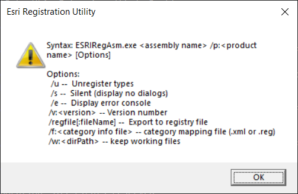

# Investigation

## Program location
"%CommonProgramFiles(x86)%\ArcGIS\bin\ESRIRegAsm.exe"

## Arguments
Screen if running ESRIRegAsm.exe without arguments (ArcGIS 10.7):


TBD: arguments use by this program:
<assembly name> - will be expanded to full path (at least earlier ESRIRegAsm versions required this)
/s - enforce
/e - enforce

## Output examples of the new console

### Success
```

**********************************


ESRIRegAsm::Register
  Command line: C:\folder1\folder2\folder2\myextension.dll /p:Desktop /s /e

  Registry Capture On.
  Registering native library...
  Registry Capture Off.
  Processing Registry Entries...
  No categories to register.

Operation Succeeded

**********************************

Press Enter to continue...
```

### Error
```

**********************************


ESRIRegAsm::Register
  Command line: C:\Windows\notepad.exe /p:Desktop /s /e

  ERROR: LoadLibrary failed with specified path.

Operation Failed
00D3F308

**********************************

Press Enter to continue...
```

## Arguments parser
  
  Check out https://github.com/natemcmaster/CommandLineUtils/blob/main/test/CommandLineUtils.Tests/ArgumentAttributeTests.cs. It seems it supports positional arguments.
